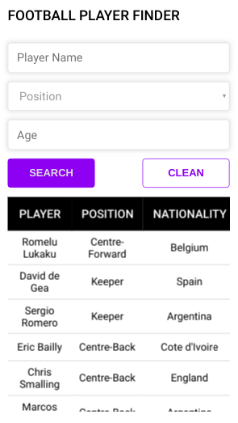
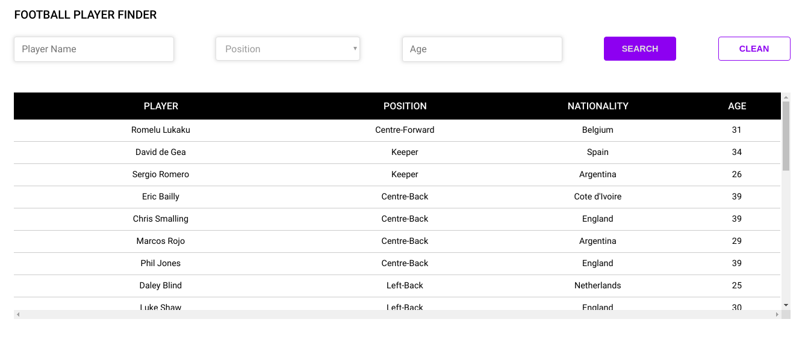

# Fantasy Football

Find players app using a football API

# Mobile view

# Desktop view

* `npm install` to install dependencies.
* `npm run start` to dev environment.
* `npm run build && npm start` to production environment.
* `npm run lint` to run the linter.
* `npm run test` to run unit testing.

## License

MIT